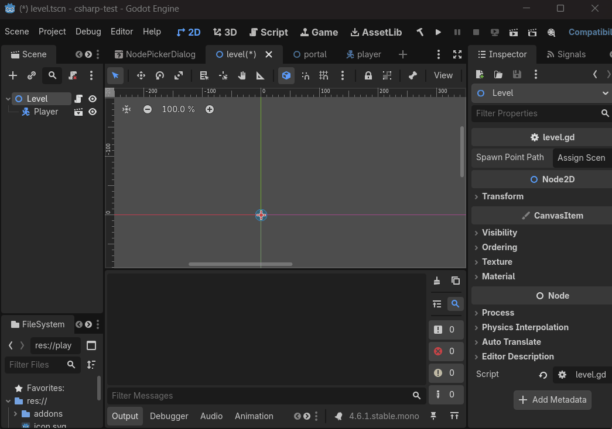

# SceneNodePath for Godot 4

**SceneNodePath** provides a bulletproof way to reference and instantiate specific Nodes residing within external `PackedScene` files.


*The custom Inspector UI allows you to browse and filter any external scene's hierarchy.*

### The Problem
Standard Godot development often requires referencing a node inside a separate scene (e.g., a "Spawn Point" inside a "Level" scene). Usually, you export a `PackedScene`, instantiate it, and then call `get_node("Path/To/Node")`. This is **brittle**: if you rename or move the node inside the source scene, your code breaks silently at runtime.

### The Solution
`SceneNodePath` is a custom Resource that stores a **UID-based reference** to both the scene file and the specific node path. It provides a dedicated Inspector UI to browse the external scene and pick your target node safely.

## Key Features
- **Visual Node Picker:** Browse the hierarchy of any scene file directly from the Inspector.
- **Reference Stability:** Uses UIDs for both files and nodes. References survive file moves and renames.
- **Type-Filtered Exports:** Restrict the picker to specific Node types (e.g., only allow selecting `Area3D`).
- **Language Parity:** Fully featured API for both **GDScript** and **C#** (`SceneNodePathCS`).

---

## Quick Start

### 1. Basic Usage
Assign the path in the Inspector, then instantiate it at runtime.

```gdscript
@export var portal_exit: SceneNodePath

func setup():
    var result = portal_exit.instantiate()
    if result:
        add_child(result.root) # The entire scene hierarchy
        var target = result.node # The specific node you picked
```

### 2. Isolated Extraction
If you only want the specific node and don't care about its original scene context:

```gdscript
# Instantiates, isolates the node, and frees the rest of the scene automatically.
var boss = boss_path.extract()
add_child(boss)
```

### 3. Type Filtering
Enforce strict type safety in the Inspector using Godot's `@export_custom` annotation.

```gdscript
# Only allow selecting 'Camera3D' nodes within the target scene.
@export_custom(PROPERTY_HINT_RESOURCE_TYPE, "SceneNodePath:Camera3D")
var cutscene_camera: SceneNodePath
```

---

## Deep Inspection
Godot's `SceneState` API is powerful but notoriously difficult to use, requiring manual index management. `SceneNodePath` provides a **StateInspector** wrapper that allows you to query the target node's data without instantiating it into the scene tree.

```gdscript
var inspector = portal_path.peek()
if inspector.is_valid():
    print("Node Type: ", inspector.get_node_type())
    print("Groups: ", inspector.get_groups())
    print("Properties: ", inspector.get_properties())
```
*Useful for verifying "locked" doors, checking team alignments, or reading dialogue triggers directly from the scene file.*

---

## Installation
1. Move the `addons/scene_node_path` folder into your project's `res://addons/` directory.
2. Enable the plugin in **Project Settings -> Plugins**.
